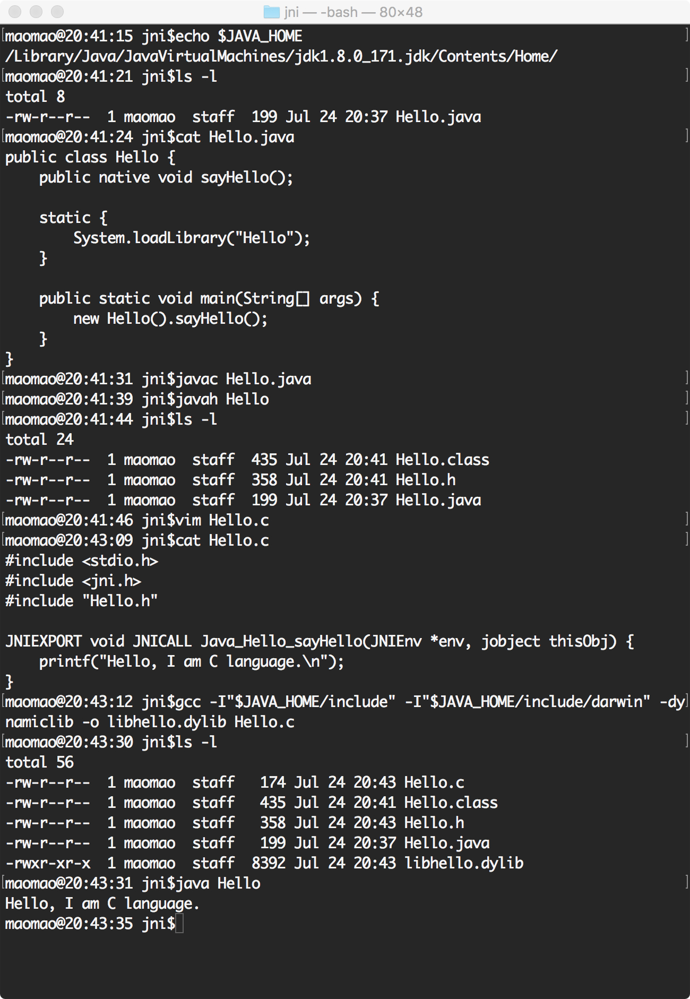

# Java Native Interface

记录一个简单的 Java Native Interface (JNI) 代码示例

Hello.java:

```java
public class Hello {

    static {
        System.loadLibrary("Hello");
    }

    public native void sayHello();

    public static void main(String[] args) {
        new Hello().sayHello();
    }
}
```

Hello.c:

```c
#include <stdio.h>
#include <jni.h>
#include "Hello.h"

JNIEXPORT void JNICALL Java_Hello_sayHello(JNIEnv *env, jobject thisObj)
{
    printf("Hello, I am C languager.\n");
}
```

bash:

```bash
javac Hello.java
javah Hello
gcc -I "$JAVA_HOME/include" -I "$JAVA_HOME/include/darwin" -dynamiclib -o libhello.dylib Hello.c
java Hello
```


