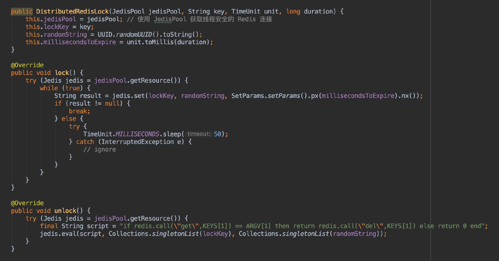

单实例的 Redis 分布式锁的具体算法：
1. 获取锁的过程：使用 `SET key value NX PX milliseconds` 命令，尝试在 Redis 中设置一个唯一的随机值。若设值成功则表示获取锁成功，若设值失败则表示获取锁失败；
2. 释放锁的过程：当且仅当 key 存在且 key 对应的 value 值和获取锁时设置的值相等时，删除 key，表示释放锁成功，否则表示释放锁失败。这段逻辑的代码需要使用 Lua 脚本执行；

在这个实现算法中，有几点需要注意：
* 获取锁时，需要设置一个 key 的过期时间，这是为了避免在客户端崩溃时造成死锁的状况；
* 获取锁时，需要设置一个唯一的随机值，并且需要在释放锁时被比对，这是为了避免释放由其它客户端创建的锁；
* 为了避免产生竞态条件，获取锁和释放锁都需要有原子性的保障。所以在设置锁时需要使用 `SET key value NX PX milliseconds` 命令，而不是先 `SET key value NX` 再 `EXPIRE key seconds`，而且释放锁时也需要使用 Lua 脚本；

在使用单实例的 Redis 分布式锁的情况下，如果唯一的 Redis 实例挂了，那么分布式锁功能则完全失效了。为此 Redis 社区提出了一种多实例 Redis 的分布式锁算法——Redlock。

Redlock 的大致思路是假设存在 2n+1 台 Redis 实例，当应用获取锁时，需在限定的超时时间内向这些 Redis 实例批量地设置相同的 key 和 value，如果某台 Redis 实例在超时时间内没有设值成功，则应该尽快跳过这台实例。最终，如果在 >n 台实例上设值成功，则表示获取锁成功，否则表示获取锁失败，并且需要删除所有 Redis 实例上的 key。当应用释放锁时，只是简单地向所有 Redis 实例发送释放锁的命令。

原文链接：https://redis.io/topics/distlock ，示例代码如下

