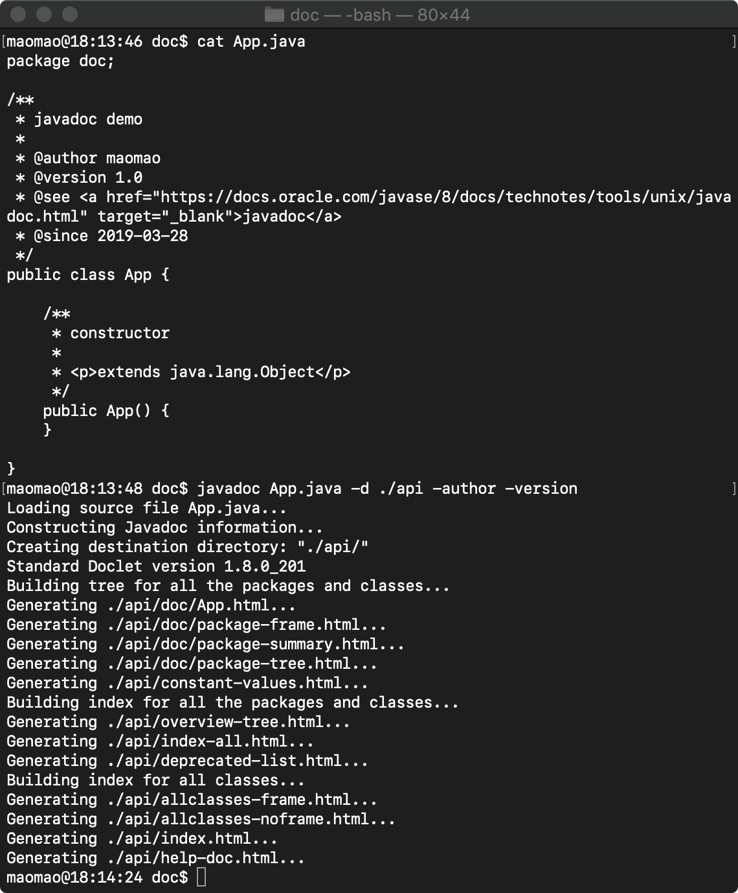
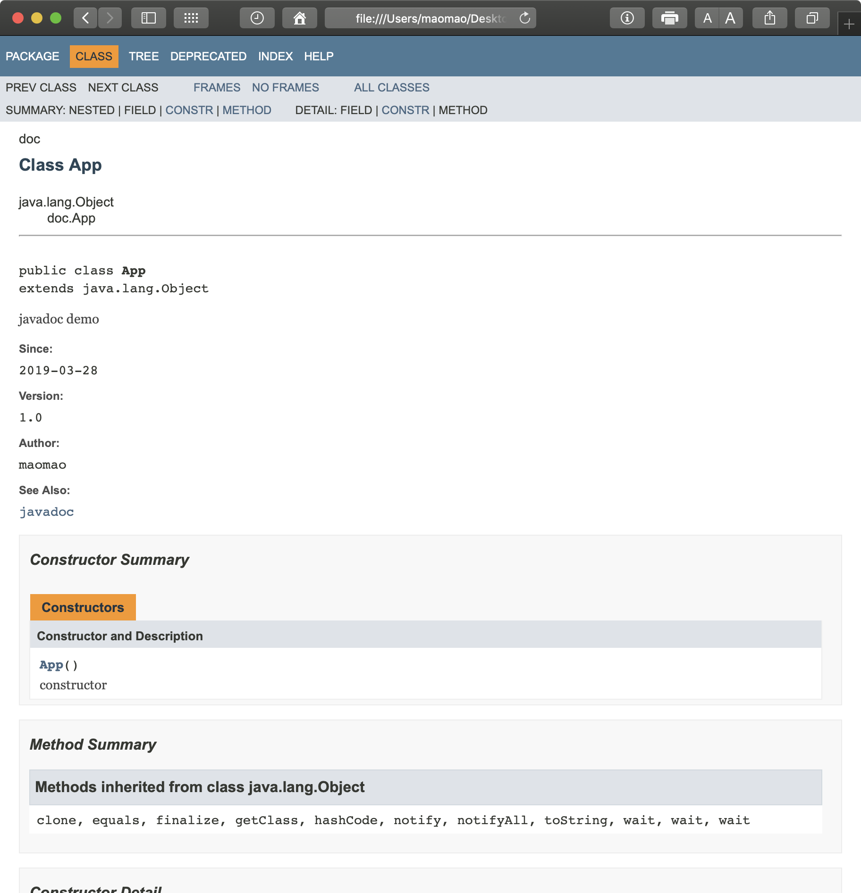

javadoc 是 JDK bin 目录下的一个命令行工具，可以从 Java 源代码中生成 API 的 HTML 页面文档。

javadoc 的基本使用方式：
`javadoc {packages|source-files} [options] [@argfiles]`
* packages: 指定需要生成文档的包名，多个包名使用空格分隔，例如 `java.lang java.lang.reflect java.awt`；
* source-files: 指定需要生成文档的类名，多个类名使用空格分隔，例如 `Class.java Object.java Button.java`；
* options: 指定 javadoc 运行的命令行选项，具体请见 https://docs.oracle.com/javase/8/docs/technotes/tools/unix/javadoc.html#CHDFDACB ；
* @argfiles 指定一个文件，文件内容包含了 javadoc 运行的命令行参数；

javadoc 简单的使用方式如下

生成的 API 文档如

更多 javadoc 的使用例子请见官方文档 https://docs.oracle.com/javase/8/docs/technotes/tools/unix/javadoc.html#CHDJBGFC 。

javadoc 的使用方式有以下几点需要注意：
1. 默认情况下，javadoc 生成的文档只针对 public、protected 修饰的类、内部类（非内部嵌套类）、接口、构造方法、普通方法、字段；
2. 需要使用 `-subpackages` 参数，javadoc 才可以递归遍历子目录，生成包下完整的 API 文档；
3. 标准 doclet 不会验证文档注释的内容是否正确，也不会尝试更正文档注释中的错误；
4. ......（官方文档中还提及了很多需要注意的事项）

javadoc 会从以下类型的源文件中，生成 API 文档的内容：
* Java 类的源文件（*.java）；
* 包注释文件（package-info.java、package.html）；
* 概览注释文件（overview.html）；
* 杂项未处理的文件；

javadoc 生成 API 文档的页面结构包括：apidocs 顶级目录、Java 包目录、src-html 源代码目录，具体请见 https://docs.oracle.com/javase/8/docs/technotes/tools/unix/javadoc.html#CHDBEDBA 。

javadoc 会解析源代码注释内容中的特定标签，这些标签以符号 `@` 开始，且是区分大小写的。主要有两类 javadoc 标签：
* Bock tags 块标签：块标签需要被放置在注释的描述部分后的标签部分中，以 `@tag` 的形式；
* Inline tags 内联标签：内联标签可以被放置在注释的描述部分中，或者紧随块标签部分的描述中，以 `{@tag}` 的形式；

标准的 javadoc 标签如下：
* @author name-text: 显示作者名；
* {@code text}: 和 \<code\>{@literal}\</code\> 作用相同；
* @deprecated deprecated-text: 表示当前 API 已经过时，不再被推荐使用（虽然 API 目前可能还是可用的）；
* {@docRoot}: 表示当前 API 文档到根文档的相对路径；
* @exception class-name description: 和 {@throws} 作用相同；
* {@inheritDoc}: 表示从最近的实现类或者接口中，继承注释文档；
* {@link package.class#member label}: 显示带有可见文本标签的内联链接，链接可以指向特定的包、类、方法、字段；
* {@linkplain package.class#member label}: 与 {@link} 作用相同，但以文本而不是代码的形式显示；
* {@literal text}: 显示文本，而不将文本解释为 HTML 标签或嵌套的 javadoc 标签；
* @param parameter-name description: 显示方法参数的描述；
* @return description: 显示返回结果的描述；
* @see reference: 显示「See Also」的条目，引用指向新的链接或文档条目；
* @serial field-description | include | exclude: JDK 序列化相关标签；
* @serialData data-description: JDK 序列化相关标签；
* @serialField field-name field-type field-description: JDK 序列化相关标签；
* @since since-text: 显示代码的改动或特性，起始于某个版本或某个时间；
* @throws class-name description: 显示异常描述；
* {@value package.class#field}: 显示常量值；
* @version version-text: 显示版本号；