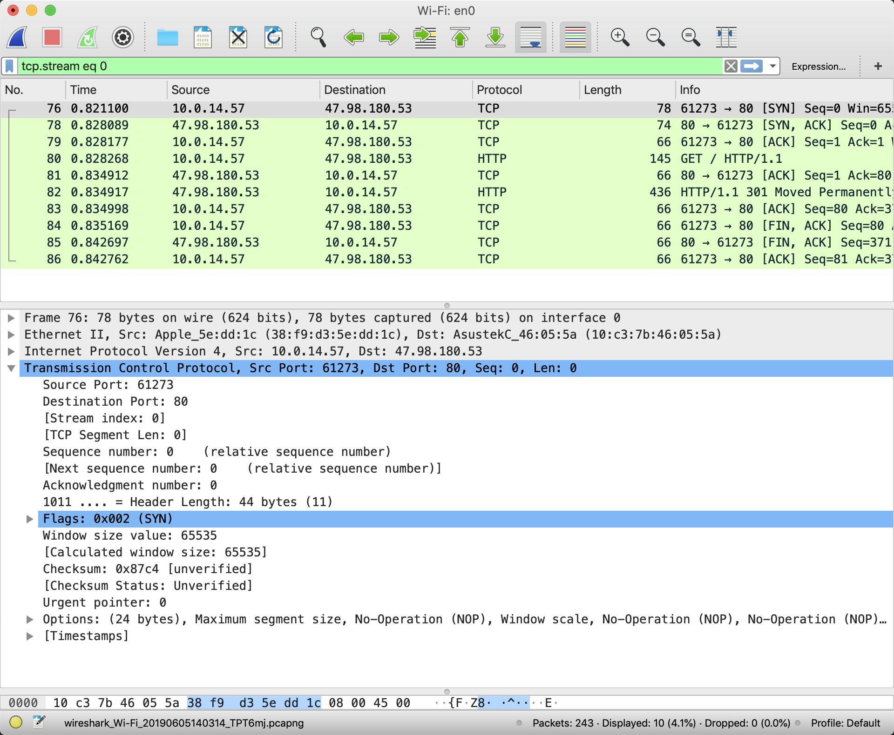
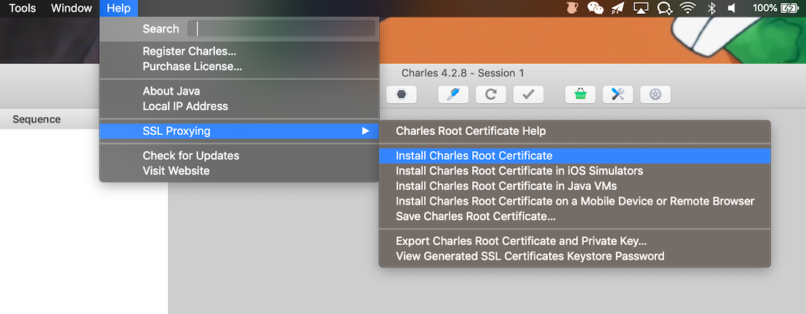

一般情况下，开发人员想要在 macOS 上抓取和分析网络数据包，可以用 [Wireshark](https://www.wireshark.org/) 和 [Charles](https://www.charlesproxy.com/) 这两个软件。

## Wireshark
Wireshark 是广泛使用的网络协议分析软件，它可以让开发者观察微观层面上发生的网络事件。下图是使用 Wireshark 抓取的网络数据包，先后发生了 TCP 协议的三次握手、HTTP 协议的发送请求和接收响应、TCP 协议的四次挥手，抓取的数据包中显示了应用层的 HTTP 协议、传输层的 TCP 协议、网络层的 IP 协议，以及更底层的数据链路层和物理层的相关协议数据。

Wireshark 提供了非常丰富的功能特性，具体使用请查看官方文档：https://www.wireshark.org/docs/ 。

## Charles
Charles 是一个 HTTP 代理 / HTTP 监控 / HTTP 反向代理 软件，它可以让开发者查看被代理设备上的 HTTP/HTTPS 协议的报文内容（Wireshark 可以查看 SSL 协议数据，但是没有办法查看使用 SSL 协议加密后的 HTTP 协议数据。

使用 Charles 需要明白以下两点：
1. Charles 通过设置 HTTP 代理来监控 HTTP 请求和响应，所以只要网络上的终端设备设置了 Charles 开启的 HTTP 代理，就可以通过 Charles 来查看终端设备上经过的 HTTP 请求和相应。通过这种方式，手机、平板、智能家居、甚至代码片段都可以实现监控 HTTP 协议的功能。
2. Charles 通过安装 CA 证书，以中间人（man-in-the-middle）代理的方式查看 HTTPS 协议的报文内容，所以想要查看终端设备上的 HTTPS 协议内容，需要先在终端设备上安装 Charles 的 CA 证书，并且设置为信任。安装各类终端设备证书在 *Help -&gt; SSL Proxying -&gt; Install Charles Root Certificate ......* 中，更具体的步骤可以查看 Charles 团队撰写的文档：https://www.charlesproxy.com/documentation/using-charles/ssl-certificates/ 。
