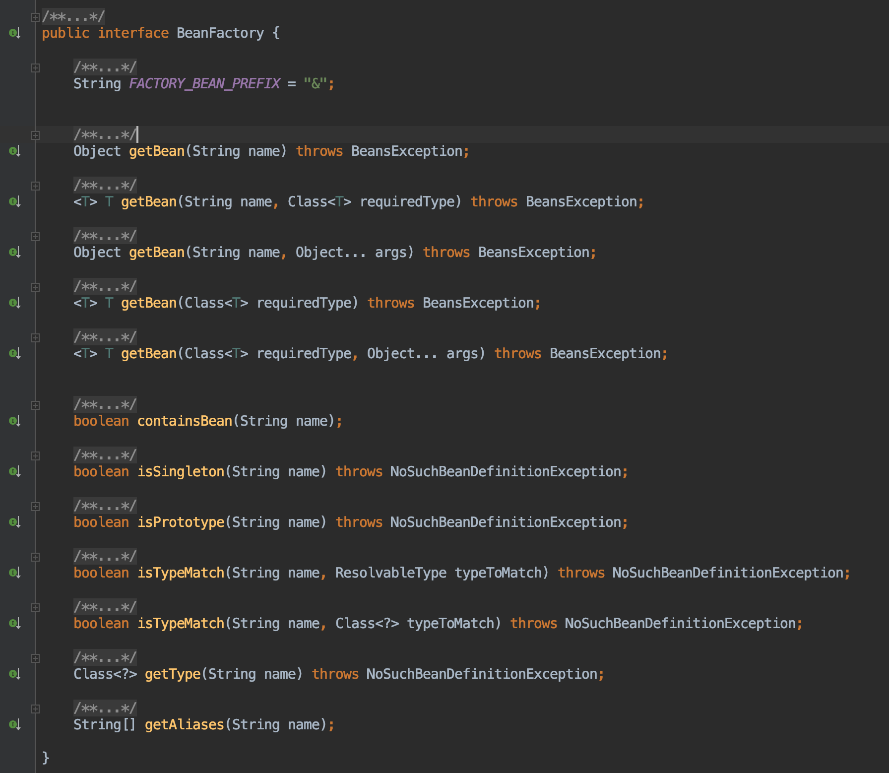
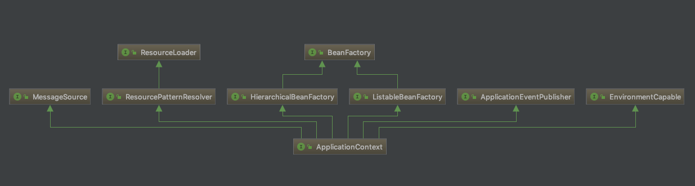

# 一些概念篇

## IoC 容器简介，Bean 简介
Inversion of Control（控制反转）等同于 Dependency Injection（依赖注入），两者只是描述角度的不同。

对象的的依赖，是指一个对象正常工作时所需要其它对象。

定义对象之间的依赖关系，是指通过构造方法的参数、工厂方法的参数，或者是使用构造方法/工厂方法创建对象之后再使用 setter 方法设置对象属性的过程。

IoC 将定义对象之间的依赖关系的控制权，从开发者手中转移到了 IoC 容器中，这就是所谓的控制反转。具体地来说，IoC 容器会在创建对象时候，主动地注入对象之间的依赖关系。

Spring IoC 的基本实现是在 `org.springframework.beans` 和 `org.springframework.context` 两个包中。

`BeanFactory` 接口定义了一种管理对象的机制，如下图所示：



`ApplicationContext` 是 `BeanFactory` 的子接口，添加了
* 简单集成了 Spring AOP 特性
* 资源加载机制
* 发布事件机制
* 特定应用层的上下文（例如 WebApplicationContext、ClassPathXmlApplicationContext）



简而言之，`BeanFactory` 提供了对象配置功能的骨架和容器基本功能的定义，`ApplicationContext` 添加了更多企业级应用开发的功能特性。

---

## 容器概览
`ApplicationContext` 代表了 Spring IoC 容器的高级形态，会解析读取配置元数据（Configuration Metadata），然后实例化、配置、装配容器中的 Bean。

容器的基本使用方式：略。

---

## Bean 概览
Spring IoC 容器根据开发者提供给的配置元数据创建 Bean，例如 XML 文件中的 `<bean/>`、Java 代码中的 `@Bean`。

对于容器来说，这些 Bean 的定义是以 `BeanDefinition` 对象表示的。`BeanDefinition` 接口包含了一下元数据：
* 全限定类名
* Bean 行为配置元素（scope、lazy initialization、lifecycle callbacks 等等）
* 依赖的其它 Bean
* 其它的初始化设置（线程池大小、连接池大小等等）

---

## Dependencies
关于使用依赖注入的好处，Spring 官方文档是这样描述的：
> Code is cleaner with the DI principle, and decoupling is more effective when objects are provided with their dependencies. The object does not look up its dependencies and does not know the location or class of the dependencies. As a result, your classes become easier to test, particularly when the dependencies are on interfaces or abstract base classes, which allow for stub or mock implementations to be used in unit tests.

依赖注入主要有两种方式：基于构造方法的注入和基于 setter 方法的注入。

依赖注入的具体使用方式：略。

[如何解决环形的依赖关系](https://docs.spring.io/spring/docs/5.1.8.RELEASE/spring-framework-reference/core.html#beans-dependency-resolution)

---

## Bean 作用域
Spring 支持的 Bean 的作用域有：
* singleton（默认值）对于每一个 IoC 容器来说是单例的
* prototype 会创建多个实例
* request 依赖于 HTTP Request 的生命周期
* session 依赖于 HTTP Session 的生命周期
* application 依赖于 ServletContext 的生命周期
* websocket 依赖于 WebSocket 的生命周期

---

## Bean 生命周期
为了和 IoC 容器管理的 Bean 生命周期交互，开发者可以实现 Spring 的 `InitializingBean` 和 `DisposableBean` 接口。IoC 容器会在初始化 Bean 之前调用 `afterPropertiesSet()` 和在销毁 Bean 之后调用 `destroy()` 方法。

JSR-250 规范中的 `@PostConstruct` 和 `@PreDestroy` 也可以实现上述效果。除此之外，还以可以在定义 Bean 的时候显示指定 `init-method` 和 `destroy-method` 参数。

上述三种方式的优先级是：
1. `@PostConstruct` 和 `@PreDestroy`
2. `InitializingBean#afterPropertiesSet()` 和 `DisposableBean#destroy()`
3. 自定义的 `init-method` 和 `destroy-method` 方法

在 Spring 内部是使用 `BeanPostProcessor` 接口实现 Bean 的前置和后置方法。

---

## 容器扩展点

### 通过使用 `BeanPostProcessor` 接口自定义 Bean
例如使用 `ApplicationContextAwareProcessor` 实现 *Aware 的一系列接口。

### 通过使用 `BeanFactoryPostProcessor` 接口自定义配置元数据
例如实现 `BeanDefinitionRegistryPostProcessor` 接口可以修改预先定义的 `BeanDefinition`。

### 通过使用 `FactoryBean` 接口自定义 Bean 的实例化逻辑
例如使用 `ProxyFactoryBean` 生成 AOP 代理类。

---

# 源码走读篇

## 初始化 IoC 容器
以 `ClassPathXmlApplicationContext` 为例讲解 Spring IoC 容器的初始化过程：

**初始化 IoC 容器**
```java
ApplicationContext applicationContext = new ClassPathXmlApplicationContext("applicationContext.xml");
```

```java
// ClassPathXmlApplicationContext
public ClassPathXmlApplicationContext(String configLocation) throws BeansException {
    this(new String[] {configLocation}, true, null);
}

public ClassPathXmlApplicationContext(String[] configLocations, boolean refresh, ApplicationContext parent) throws BeansException {
    super(parent);
    // 设置 XML 配置文件地址
    setConfigLocations(configLocations);
    if (refresh) {
        // 刷新 ApplicationContext
        refresh();
    }
}
```

**设置 XML 配置文件地址，创建 Environment**
```java
// AbstractRefreshableConfigApplicationContext
public void setConfigLocation(String location) {
    setConfigLocations(StringUtils.tokenizeToStringArray(location, CONFIG_LOCATION_DELIMITERS));
}

public void setConfigLocations(String... locations) {
    if (locations != null) {
        Assert.noNullElements(locations, "Config locations must not be null");
        this.configLocations = new String[locations.length];
        for (int i = 0; i < locations.length; i++) {
            // 解析 XML 配置文件地址
            this.configLocations[i] = resolvePath(locations[i]).trim();
        }
    } else {
        this.configLocations = null;
    }
}

......

protected String resolvePath(String path) {
    // 初始化 Environment，然后通过 Environment 解析 XML 配置文件地址
    return getEnvironment().resolveRequiredPlaceholders(path);
}
```

```java
// AbstractApplicationContext
@Override
public ConfigurableEnvironment getEnvironment() {
    if (this.environment == null) {
        this.environment = createEnvironment();
    }
    return this.environment;
}

protected ConfigurableEnvironment createEnvironment() {
    // 创建 StandardEnvironment
    return new StandardEnvironment();
}
```

**刷新 ApplicationContext**
```java
// AbstractApplicationContext
@Override
public void refresh() throws BeansException, IllegalStateException {
    synchronized (this.startupShutdownMonitor) {
        // 准备刷新 ApplicationContext
        prepareRefresh();
        // 获取可刷新的 BeanFactory
        ConfigurableListableBeanFactory beanFactory = obtainFreshBeanFactory();

        // 配置 BeanFactory
        prepareBeanFactory(beanFactory);

        try {
            // 创建 BeanFactory 的后置处理（例如 ServletWebServerApplicationContext 中需要处理 Web 相关事宜）
            postProcessBeanFactory(beanFactory);

            // 调用 BeanFactoryPostProcessor，用于处理 BeanFactory 中的 BeanDefinition
            invokeBeanFactoryPostProcessors(beanFactory);

            // 注册 BeanPostProcessor
            registerBeanPostProcessors(beanFactory);

            // 初始化 MessageSource
            initMessageSource();

            // 初始化 ApplicationEventMulticaster，用于管理 ApplicationListener 和发布 ApplicationEvent
            initApplicationEventMulticaster();

            // 初始化其它特定子类 ApplicationContext 中的初始化方法
            onRefresh();

            // 注册 ApplicationListener
            registerListeners();

            // Instantiate all remaining (non-lazy-init) singletons.
            finishBeanFactoryInitialization(beanFactory);

            // 完成刷新 ApplicationContext
            finishRefresh();
        } catch (BeansException ex) {
            if (logger.isWarnEnabled()) {
                logger.warn("Exception encountered during context initialization - " +
                            "cancelling refresh attempt: " + ex);
            }

            // 销毁已经创建的 Bean，避免资源浪费
            destroyBeans();

            // 取消刷新 ApplicationContext，重新设置 active 状态位
            cancelRefresh(ex);

            // 抛出异常
            throw ex;
        } finally {
            // 重新设置 Spring 内部的缓存
            resetCommonCaches();
        }
    }
}

// 准备刷新 ApplicationContext
protected void prepareRefresh() {
    this.startupDate = System.currentTimeMillis();
    this.closed.set(false);
    this.active.set(true);

    if (logger.isInfoEnabled()) {
        logger.info("Refreshing " + this);
    }

    // 初始化 Environment 中的 PropertySources
    initPropertySources();

    // 校验 Environment 中的所有 properties
    getEnvironment().validateRequiredProperties();

    this.earlyApplicationEvents = new LinkedHashSet<ApplicationEvent>();
}

// 获取可刷新的 BeanFactory
protected ConfigurableListableBeanFactory obtainFreshBeanFactory() {
    refreshBeanFactory();
    ConfigurableListableBeanFactory beanFactory = getBeanFactory();
    if (logger.isDebugEnabled()) {
        logger.debug("Bean factory for " + getDisplayName() + ": " + beanFactory);
    }
    return beanFactory;
}

// 配置 BeanFactory
protected void prepareBeanFactory(ConfigurableListableBeanFactory beanFactory) {
    // Tell the internal bean factory to use the context's class loader etc.
    beanFactory.setBeanClassLoader(getClassLoader());
    beanFactory.setBeanExpressionResolver(new StandardBeanExpressionResolver(beanFactory.getBeanClassLoader()));
    beanFactory.addPropertyEditorRegistrar(new ResourceEditorRegistrar(this, getEnvironment()));

    // Configure the bean factory with context callbacks.
    beanFactory.addBeanPostProcessor(new ApplicationContextAwareProcessor(this));
    beanFactory.ignoreDependencyInterface(EnvironmentAware.class);
    beanFactory.ignoreDependencyInterface(EmbeddedValueResolverAware.class);
    beanFactory.ignoreDependencyInterface(ResourceLoaderAware.class);
    beanFactory.ignoreDependencyInterface(ApplicationEventPublisherAware.class);
    beanFactory.ignoreDependencyInterface(MessageSourceAware.class);
    beanFactory.ignoreDependencyInterface(ApplicationContextAware.class);

    // BeanFactory interface not registered as resolvable type in a plain factory.
    // MessageSource registered (and found for autowiring) as a bean.
    beanFactory.registerResolvableDependency(BeanFactory.class, beanFactory);
    beanFactory.registerResolvableDependency(ResourceLoader.class, this);
    beanFactory.registerResolvableDependency(ApplicationEventPublisher.class, this);
    beanFactory.registerResolvableDependency(ApplicationContext.class, this);

    // Register early post-processor for detecting inner beans as ApplicationListeners.
    beanFactory.addBeanPostProcessor(new ApplicationListenerDetector(this));

    // Detect a LoadTimeWeaver and prepare for weaving, if found.
    if (beanFactory.containsBean(LOAD_TIME_WEAVER_BEAN_NAME)) {
        beanFactory.addBeanPostProcessor(new LoadTimeWeaverAwareProcessor(beanFactory));
        // Set a temporary ClassLoader for type matching.
        beanFactory.setTempClassLoader(new ContextTypeMatchClassLoader(beanFactory.getBeanClassLoader()));
    }

    // Register default environment beans.
    if (!beanFactory.containsLocalBean(ENVIRONMENT_BEAN_NAME)) {
        beanFactory.registerSingleton(ENVIRONMENT_BEAN_NAME, getEnvironment());
    }
    if (!beanFactory.containsLocalBean(SYSTEM_PROPERTIES_BEAN_NAME)) {
        beanFactory.registerSingleton(SYSTEM_PROPERTIES_BEAN_NAME, getEnvironment().getSystemProperties());
    }
    if (!beanFactory.containsLocalBean(SYSTEM_ENVIRONMENT_BEAN_NAME)) {
        beanFactory.registerSingleton(SYSTEM_ENVIRONMENT_BEAN_NAME, getEnvironment().getSystemEnvironment());
    }
}
```

**创建 BeanFactory**
```java
// AbstractRefreshableApplicationContext
@Override
protected final void refreshBeanFactory() throws BeansException {
    // 刷新 BeanFactory，如果未创建则需要创建一下
    if (hasBeanFactory()) {
        destroyBeans();
        closeBeanFactory();
    }
    try {
        // BeanFactory 默认是以 DefaultListableBeanFactory 为实现类
        DefaultListableBeanFactory beanFactory = createBeanFactory();
        beanFactory.setSerializationId(getId());
        customizeBeanFactory(beanFactory);
        // 从 XML 中加载 BeanDefinition
        loadBeanDefinitions(beanFactory);
        // 保存 BeanFactory 实例引用
        synchronized (this.beanFactoryMonitor) {
            this.beanFactory = beanFactory;
        }
    } catch (IOException ex) {
        throw new ApplicationContextException("I/O error parsing bean definition source for " + getDisplayName(), ex);
    }
}
```

---

## 从 IoC 容器中获取 Bean