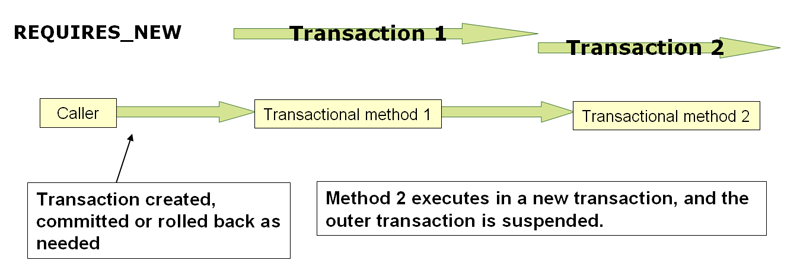

# Spring 事务传播行为

通常，在一个事务作用域内执行的代码，都会在该事务中运行。然而，当在已经存在事务的方法中执行新的事务方法时，Spring 允许开发者指定这些事务之间具体的传播行为。

Spring 在 [`Propagation`](https://github.com/spring-projects/spring-framework/blob/master/spring-tx/src/main/java/org/springframework/transaction/annotation/Propagation.java) 枚举类和 [`TransactionDefinition`](https://github.com/spring-projects/spring-framework/blob/master/spring-tx/src/main/java/org/springframework/transaction/TransactionDefinition.java) 接口中定义了事务的传播行为，具体字段如下：

| 传播行为                    | 说明                                                                   |
| --------------------------- | ---------------------------------------------------------------------- |
| `Propagation.REQUIRED`      | 支持当前事务；如果当前不存在事务，则创建事务                           |
| `Propagation.SUPPORTS`      | 支持当前事务；如果当前不存在事务，则以非事务方式执行                   |
| `Propagation.MANDATORY`     | 支持当前事务；如果当前不存在事务，则抛出异常                           |
| `Propagation.REQUIRES_NEW`  | 创建新的事务；如果当前存在事务，则挂起当前事务                         |
| `Propagation.NOT_SUPPORTED` | 以非事务方式执行；如果当前存在事务，则挂起当前事务                     |
| `Propagation.NEVER`         | 以非事务方式执行；如果当前存在事务，则抛出异常                         |
| `Propagation.NESTED`        | 以嵌套事务方式执行；如果当前不存在事务，则与 Propagation.REQUIRED 类似 |

在 Spring 管理的事务中，需要注意物理事务和逻辑事务的区别，以及传播行为如何适用于这两者之间的差异。

## 理解 Propagation.REQUIRED

`Propagation.REQUIRED` 强制执行物理事务，不论是在尚不存在事务的当前作用域中，或者是在需要加入的已经存在的外部事务所定义的更大的作用域中。对于在同一个线程中的方法调用，`Propagation.REQUIRED` 是很好的默认值。例如，在 service 层调用的 repository 层方法的场景中，repository 层的所有 `Propagation.REQUIRED` 传播级别的事务方法都依赖于 service 层的事务定义。

当传播级别设置为 `Propagation.REQUIRED` 时，Spring 会为每个事务方法创建一个逻辑事务。每个逻辑事务可以独立地设置它的回滚状态，外部事务和内部事务在逻辑上互相独立。在标准的 `Propagation.REQUIRED` 使用场景中，这些逻辑事务的作用域最终都会映射到物理事务中。所以，在内部事务中设置的回滚状态的确会影响到外部事务的提交。

然而，当内部事务设置了回滚状态，但外部事务还未决定回滚的情况下，此时的事务回滚（由内部事务静默触发）是意外的。这时，Spring 会抛出一个相应的 `UnexpectedRollbackException` 异常，为了让事务方法的调用者不会被误导以为事务回滚是正常的程序流程。所以，如果内部事务（外部事务是无感知的）静默地设置了事务的回滚状态，则外部事务仍然会提交事务。外部事务需要接收 `UnexpectedRollbackException` 异常从而显示指示回滚操作已经被执行了。

## 理解 PROPAGATION_REQUIRES_NEW

`PROPAGATION_REQUIRES_NEW` 相比于 `Propagation.REQUIRED` 而言，它始终都会为受事务影响的作用域创建一个独立的物理事务，并且不会参与已经存在的外部作用域的事务。基于这种设计，所以 `PROPAGATION_REQUIRES_NEW` 传播级别的底层事务都是互相隔离的，也因此，各个底层的事务都可以独立提交或者回滚，外部事务也不会受到内部事务的回滚状态的影响，内部事务在提交之后也能立刻释放相关资源。这种独立的内部事务可以设置它自己的隔离级别、超时时间、只读属性，而不再继承外部事务的相关属性了。

## 理解 PROPAGATION_NESTED

`PROPAGATION_NESTED` 创建一个具有多个 savepoint 的物理事务，事务可以部分回滚至预先设定的 savepoint。这种部分回滚的机制使得内部事务可以触发属于它自己作用域的事务回滚，也使得外部事务可以在内部事务回滚之后继续执行。这种部分回滚的机制通常基于 JDBC savepoint 实现，所以它仅能在 JDBC 事务的场景下使用，详情请参考 Spring 的 [`DataSourceTransactionManager`](https://github.com/spring-projects/spring-framework/blob/master/spring-jdbc/src/main/java/org/springframework/jdbc/datasource/DataSourceTransactionManager.java)。
