# Arthas

Arthas 是阿里巴巴开源的在线 Java 诊断工具，功能十分强大。下面记录一些 Arthas 3.1.1 版本中的一些命令使用方式，最新版和完整版的命令请看 [官方文档](https://alibaba.github.io/arthas/commands.html)。

---

## JVM 和 ClassLoader 相关

### dashboard
查看 JVM 线程、内存、GC 等信息

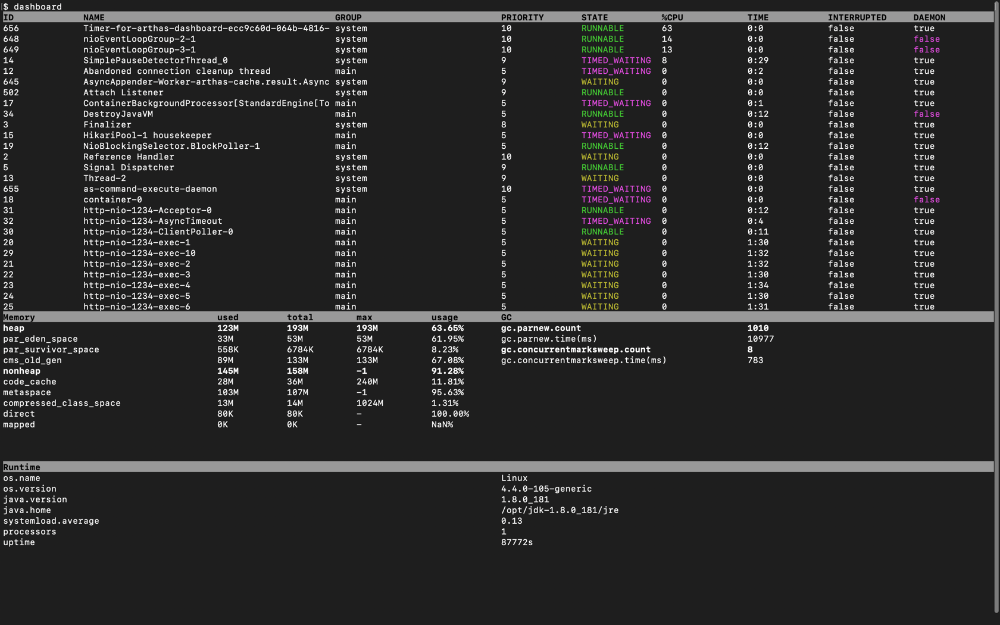

### jvm
查看 JVM 信息

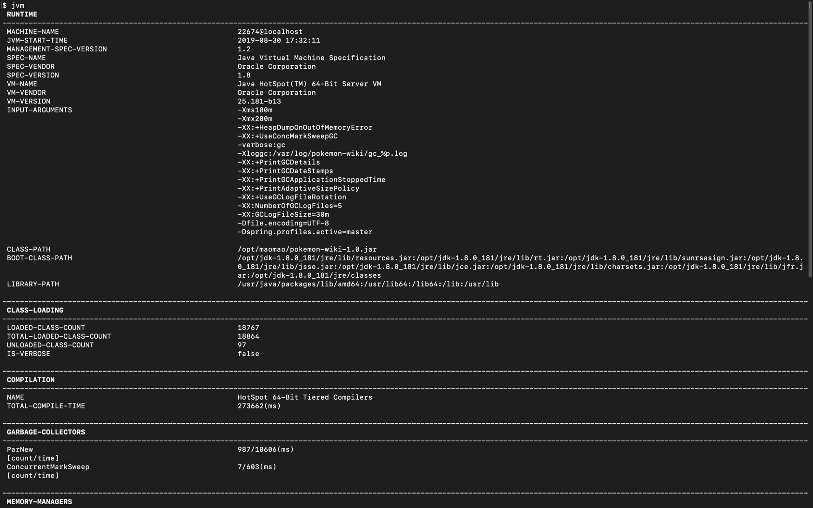

### sysprop
查看 JVM 系统属性

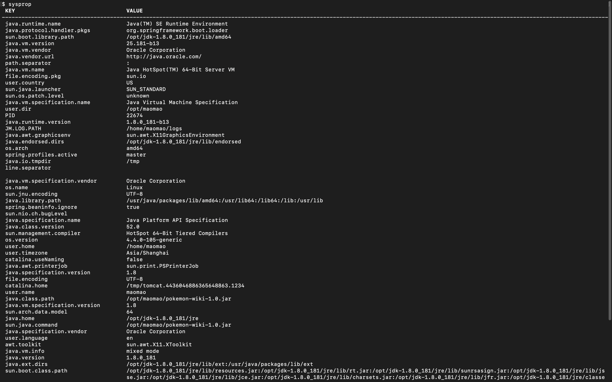

### sysenv
查看 JVM 环境属性

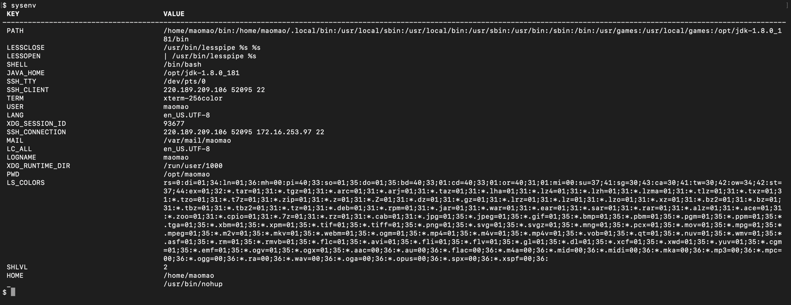

### sc(search class)
查看 JVM 已加载类的信息

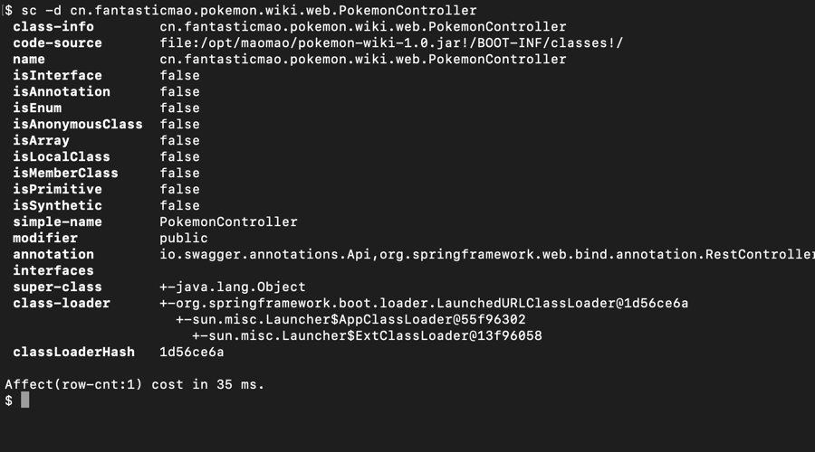

### sm(search method)
查看 JVM 已加载类的方法信息

### classloader
查看 ClassLoader 的继承树、urls、类加载信息

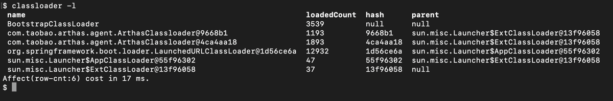

### thread
查看线程信息和线程堆栈信息

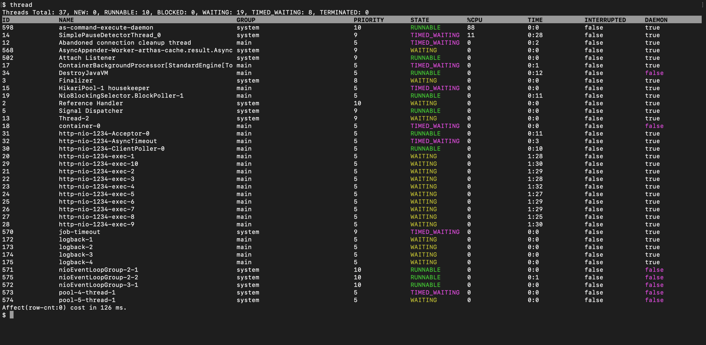

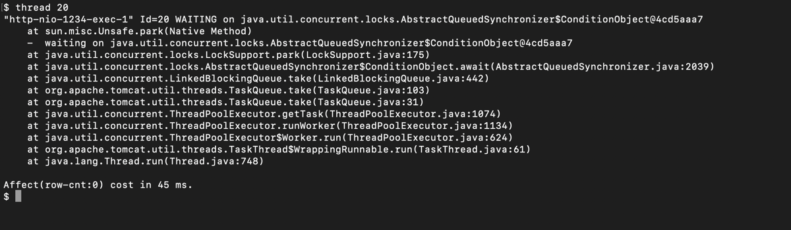

---

## 类结构和源码相关

### jad
反编译 JVM 已加载类的源码

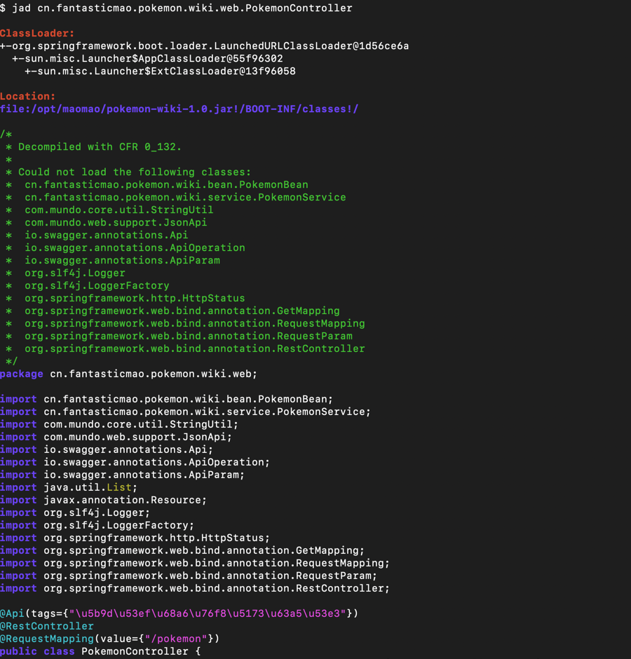

### getstatic
查看 JVM 已加载类的静态属性

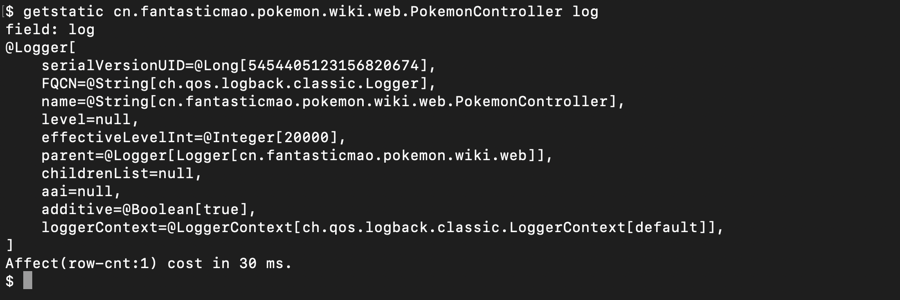

---

## 运行时数据相关

### monitor
监控指定方法的执行情况

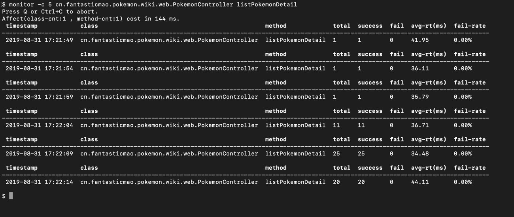

### watch
监控指定方法的执行数据

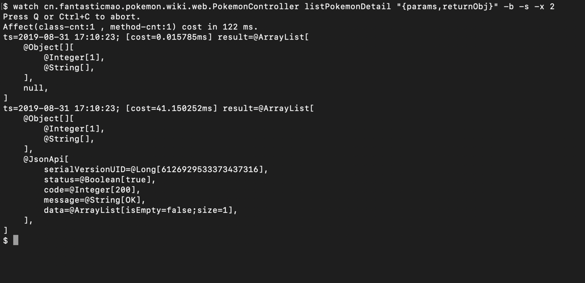

### stack
查看指定方法的调用链路

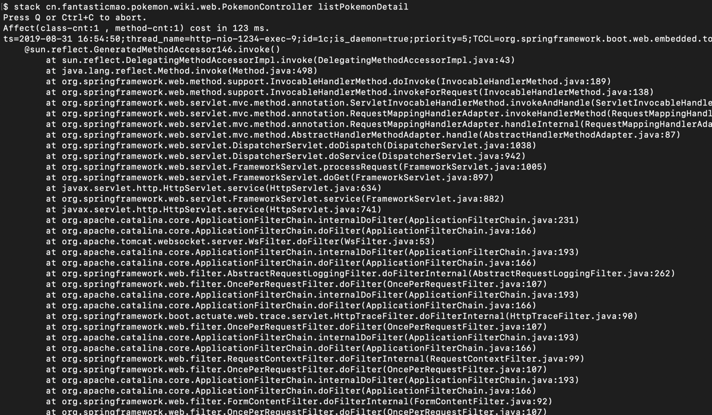

### trace
查看指定方法的内部调用链路，并输出链路上的每个节点上耗时

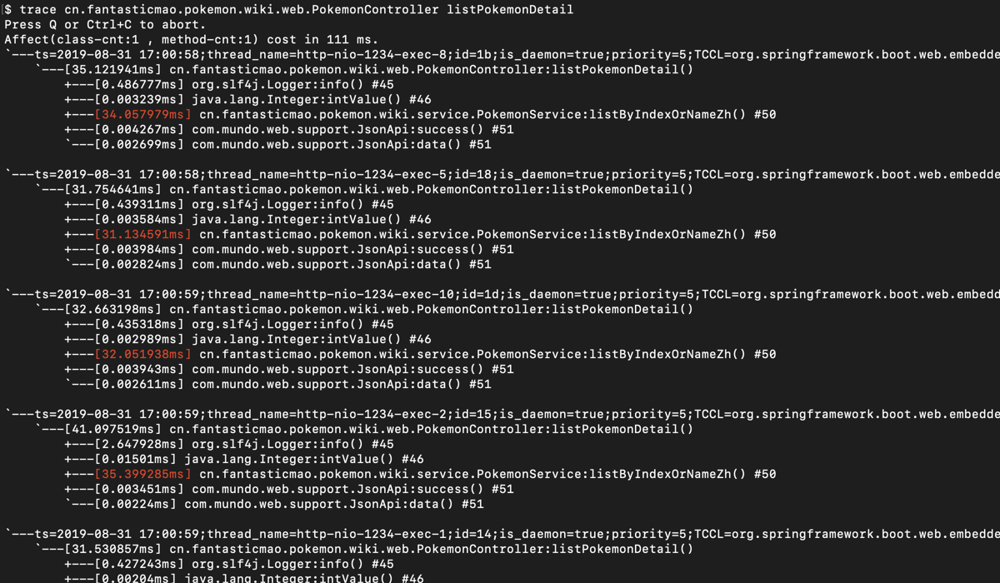

### tt(Time Tunnel)
记录方法每次调用的入参和返回信息，并对这些不同的时间下调用进行观测

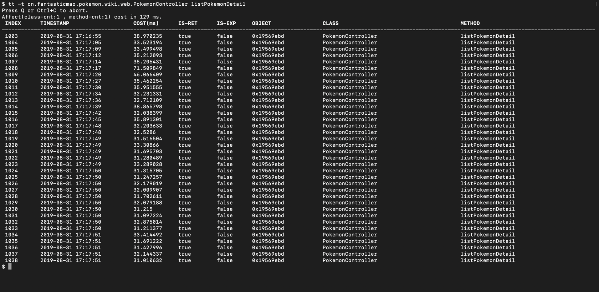