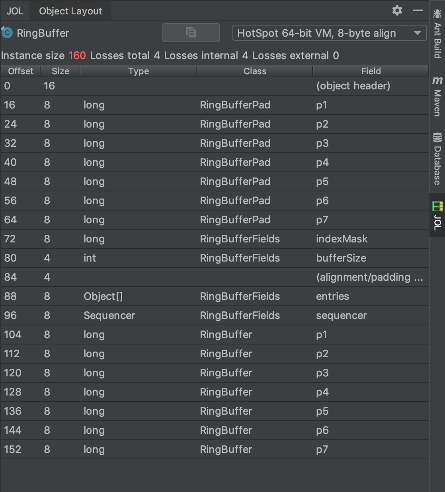

# Disruptor

Disruptor 是一个类似于 Java 中 `BlockingQueue` 的高性能内存队列，相比于 `BlockingQueue`，Disruptor 提供了以下的关键特性：

- 支持广播事件（`BlockingQueue` 只支持单播事件）
- 支持为事件预分配内存
- 内部实现基于 Lock-Free 算法（除了 `BlockingWaitStrategy` 和 `TimeoutBlockingWaitStrategy`）

## 核心概念

### Ring Buffer

`RingBuffer` 通常被认为是 Disruptor 的核心组件，但在 3.0 之后版中，`RingBuffer` 在 Disruptor 中已经被设计成只用于存储和更新数据的容器。

### Sequence

Disruptor 使用 `Sequence` 来标识 `RingBuffer` 中可用的数据段。每个消费者（`EventProcessor`）会维护一个自身的 `Sequence`。Disruptor 中无锁并发的具体实现依赖 `Sequence` 值的移动，`Sequence` 支持许多和 `AtomicLong` 类似的功能，但 `Sequence` 相比于 `AtomicLong` 而言，额外支持了「避免 [伪共享](https://www.cnblogs.com/cyfonly/p/5800758.html)」的特性。

### Sequencer

`Sequencer` 是 Disruptor 真正的核心组件。`Sequencer` 的两个实现类（`SingleProducerSequencer` 和 `MultiProducerSequencer`）实现了 Disruptor 在 Producer 和 Consumer 之间快速和正确地传递数据的所有并发算法。

### Sequence Barrier

`SequenceBarrier` 由 `Sequencer` 产生，并且包含了 `Sequencer` 发布的 `Sequence` 引用和这些 `Sequence` 所依赖的所有 Consumer。`SequenceBarrier` 实现了「是否有可消费的 Event 需要 Consumer 处理」的逻辑。

### Wait Strategy

`WaitStrategy` 决定了 Consumer 如何等待在 Disruptor 中由 Producer 发布的 Event。

### Event

Event 是由 Producer 传递给 Consumer 的数据单元。

### EventProcessor

`EventProcessor` 是处理来自 Disruptor 的 Event 的主要循环程序，并且会持有 Consumer 们的 `Sequence`。在 Disruptor 中，`BatchEventProcessor` 实现了 Event 的循环处理逻辑，并且会回调 `EventHandler` 接口的实现逻辑。

### EventHandler

实现 `EventHandler` 接口的类代表了 Disruptor 中的 Consumer。

### Producer

调用 `Disruptor#publishEvent(EventTranslator)` 的类代表了 Disruptor 中的 Producer。

Disruptor 的核心工作流程如下图：


---

## 代码示例

Disruptor API 相比于 `BlockingQueue` 略微复杂，下面提供一个基于 Disruptor 实现的「多生产者 -> 单消费者」的代码示例。

LogEvent.java:

```java
import com.lmax.disruptor.EventFactory;
import com.lmax.disruptor.EventTranslatorOneArg;

/**
 * 日志事件对象
 */
public class LogEvent {
    private String msg;

    public void setMsg(String msg) {
        this.msg = msg;
    }

    @Override
    public String toString() {
        return msg;
    }

    /**
     * 日志事件工厂
     */
    public static class LogEventFactory implements EventFactory<LogEvent> {

        @Override
        public LogEvent newInstance() {
            return new LogEvent();
        }
    }

    /**
     * 日志事件填充器
     */
    public static class LogEventTranslator implements EventTranslatorOneArg<LogEvent, Integer> {
        @Override
        public void translateTo(LogEvent event, long sequence, Integer index) {
            event.setMsg("event: " + index);
        }
    }
}
```

LogEventConsumer.java:

```java
import com.lmax.disruptor.EventHandler;

/**
 * 日志事件消费者
 */
public class LogEventConsumer implements EventHandler<LogEvent> {

    @Override
    public void onEvent(LogEvent event, long sequence, boolean endOfBatch) throws Exception {
        System.out.println(Thread.currentThread().getName() + " " + event);
    }
}
```

Main.java:

```java
import com.lmax.disruptor.TimeoutBlockingWaitStrategy;
import com.lmax.disruptor.dsl.Disruptor;
import com.lmax.disruptor.dsl.ProducerType;

import javax.annotation.Nonnull;
import java.util.concurrent.ThreadFactory;
import java.util.concurrent.TimeUnit;
import java.util.concurrent.atomic.AtomicInteger;

/**
 * 使用 Disruptor 实现「多生产者 -> 单消费者」模式
 */
public class Main {

    public static void main(String[] args) throws Exception {
        // 启动 Disruptor
        final LogEvent.LogEventFactory factory = new LogEvent.LogEventFactory();
        final int bufferSize = 2 << 10;
        Disruptor<LogEvent> disruptor = new Disruptor<>(factory, bufferSize, new ThreadFactory() {
            private AtomicInteger number = new AtomicInteger(0);

            @Override
            public Thread newThread(@Nonnull Runnable runnable) {
                return new Thread(runnable, "Disruptor-EventProcessor-" + number.incrementAndGet());
            }
        }, ProducerType.MULTI, new TimeoutBlockingWaitStrategy(10L, TimeUnit.MILLISECONDS)/* 消费者的等待策略 */);
        disruptor.handleEventsWith(new LogEventConsumer()); // 单个消费者
        disruptor.start();

        // 生产事件，多个生产者
        final LogEvent.LogEventTranslator eventTranslator = new LogEvent.LogEventTranslator();
        new Thread(() -> {
            for (int i = 0; i < 100; i++) {
                disruptor.publishEvent(eventTranslator, i);
            }
        }).run();

        new Thread(() -> {
            for (int i = 0; i < 100; i++) {
                disruptor.publishEvent(eventTranslator, i);
            }
        }).run();

        // 注销 Disruptor
        disruptor.shutdown(1, TimeUnit.SECONDS);
    }
}
```

---

## 源码学习

Disruptor 在并发环境下的高性能来源其内部的精巧设计，下面基于 Disruptor 3.4.2 版本源码研究和学习其中的一些优秀实现。

### RingBuffer 数据结构

在 Disruptor 中，`RingBuffer` 可以被看作是存储和更新事件数据的容器。为了充分利用 CPU 缓存机制，`RingBuffer` 使用 `Object[]` 作为容器的数据结构。Disrupto 在 `RingBuffer` 构造参数中要求数组大小 `bufferSize` 是 2 的倍数，并且 `indexMask` 字段的值为 `bufferSize - 1`。


Disruptor 使用递增的 `sequence` 序列在 `RingBuffer` 获取事件数据，基于以下取模算法：`sequence & indexMask`，即 `sequence & (bufferSize - 1)`。


`RingBuffer` 基于位运算的取模算法类似于 `java.util.HashMap` 的定位 Node 数组下标的算法，可以支持频繁地快速获取事件数据。算法的演算过程如下，当 `RingBuffer` 容器大小为 16，值为 10、26、58 的递增序列 `sequence` 都会获取相同的数组下标为 10 的事件数据。

```text
RingBuffer.bufferSize = 2 << 4 = 16
RingBuffer.indexMask = bufferSize -1 = 15

            二进制  十进制
indexMask   1111    15
sequence    1010    10  &
--------------------------
result      1010    10


参数        二进制  十进制
indexMask   1111    15
sequence   11010    26  &
--------------------------
            1010    10

参数        二进制  十进制
indexMask   1111    15
sequence  111010    58  &
--------------------------
            1010    10
```

### 为事件预分配内存，从而避免 GC

Disruptor 在启动时会为 `RingBuffer` 中的事件数组 `Object[]` 预分配内存，并且在程序运行期间，`RingBuffer` 中的事件数组永远不会被回收。基于这种设计，Disruptor 节省了 JVM 对其 GC 所耗费的时间。


### 使用偏移量，避免伪共享问题

现代 CPU 大多拥有完全或者部分独立的缓存（L1、L2、L3），这些多个缓存之间的不一致性会导致伪共享（False Sharing）问题，更多关于伪共享的内容可以参见 [False sharing](https://en.wikipedia.org/wiki/False_sharing) 和 [《伪共享 | 并发编程网》](http://ifeve.com/falsesharing/)。

为了避免在高并发场下产生的伪共享问题，Disruptor 在 `RingBuffer` 类中添加了额外的偏移量字段。删减过后的 `RingBuffer` 相关代码如下：

```java
abstract class RingBufferPad {
    protected long p1, p2, p3, p4, p5, p6, p7;
}

abstract class RingBufferFields<E> extends RingBufferPad {
    private final long indexMask;
    private final Object[] entries;
    protected final int bufferSize;
    protected final Sequencer sequencer;
}

public final class RingBuffer<E> extends RingBufferFields<E> {
    protected long p1, p2, p3, p4, p5, p6, p7;
}
```

在添加了偏移量字段之后，使用 JOL 查看 `RingBuffer` 类的字段在内存中布局情况，可以发现 `indexMask` 和 `bufferSize` 两个字段会处于一个 CPU Cache Line 中，`entries` 和 `sequencer` 两个字段会处于另一个 CPU Cache Line 中。



> 此处使用的 IDEA 插件是 [JOL Java Object Layout](https://plugins.jetbrains.om/plugin/10953-jol-java-object-layout/)，它使用 JOL 来查看对象在 JVM 内存中的布局情况。

> JOL 是 openJDK 团队开发的一个分析对象在 JVM 中布局情况的小工具，更多关于 JOL 的介绍和使用可以查看 [官方文档](https://openjdk.java.net/projects/code-tools/jol/)。

### Lock-Free 算法

// TODO

---

参考资料：

- [Disruptor's Blog](http://lmax-exchange.github.io/disruptor/)
- [Disruptor's GitHub](https://github.com/LMAX-Exchange/disruptor)
- [高性能队列——Disruptor](https://tech.meituan.com/2016/11/18/disruptor.html)
- [Log4j 2 Asynchronous Loggers](https://logging.apache.org/log4j/2.x/manual/async.html)
- [伪共享，并发编程无声的性能杀手](https://www.cnblogs.com/cyfonly/p/5800758.html)
- [JOL (Java Object Layout)](https://openjdk.java.net/projects/code-tools/jol/)
