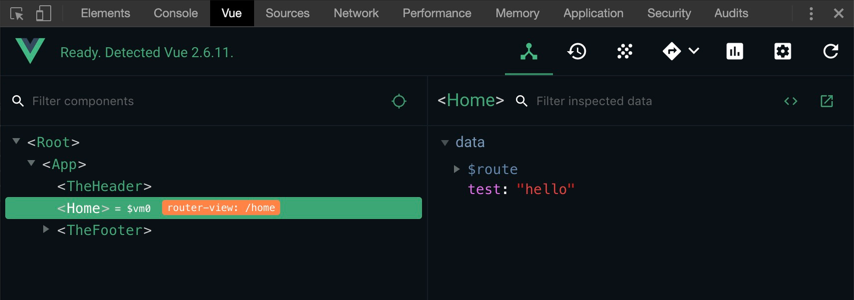
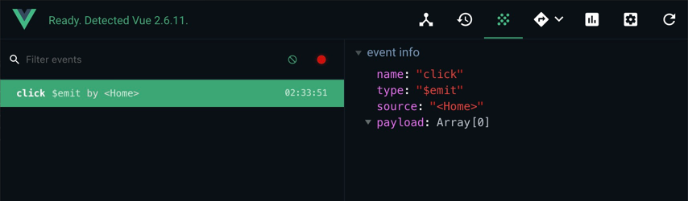
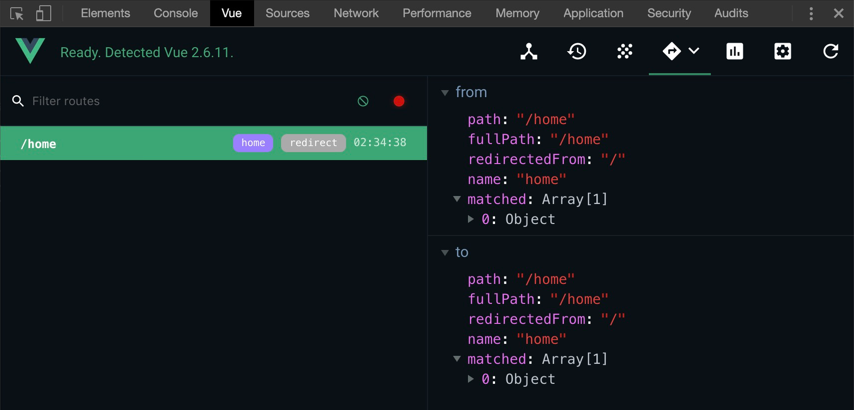

# Vue QA

## [Vue](https://vuejs.bootcss.com/v2/guide/)

### v-bing 和 v-on

v-bind 指令的缩写是 `:`，用于动态绑定一个或多个属性，或者是一个组件的 `prop`。当 v-bind 绑定的属性是 `class` 或 `style` 的时候，表达式的值可以是数组或对象。代码示例和修饰符描述请见 [官方文档](https://vuejs.bootcss.com/v2/api/#v-bind)。

v-on 指令的缩写是 `@`，用于绑定事件监听器。v-on
被用于普通元素上时只能监听 **原生 DOM 事件**，被用于自定义组件元素上时可以监听子组件触发的 **自定义事件** （由 `$emit` 定义的事件）。v-on 指令支持的修饰符有 `.stop`、`.prevent`、`.once` 等等，代码示例和更多修饰符描述请见 [官方文档](https://vuejs.bootcss.com/v2/api/#v-on)。

### `watch` 和 `computed`

Vue 实例的 `watch` 属性用于监听实例对象上的数据，代码示例请见 [官方文档](https://vuejs.bootcss.com/v2/api/#watch)。

Vue 实例的 `computed` 属性用于计算和生成实例对象的数据，代码示例请见 [官方文档](https://vuejs.bootcss.com/v2/api/#computed)。

### 父组件通过 `prop` 传递数据给子组件

在 Vue 中可以使用 `prop` 属性给子组件传递数据，代码示例请见 [官方文档](https://vuejs.bootcss.com/v2/guide/components.html#通过-Prop-向子组件传递数据)。

### 子组件通过 `emit` 反馈事件给父组件

在 Vue 中可以使用 `emit` 属性给父组件反馈事件，代码示例请见 [官方文档](https://vuejs.bootcss.com/v2/guide/components.html#通过事件向父级组件发送消息)

### 使用 \<slot\> 分发内容

在 Vue 中可以使用 `<slot>` 元素实现父子组件之间的内容分发，[官方文档](https://vuejs.bootcss.com/v2/guide/components-slots.html) 提供了一份精简的代码示例，完善之后的内容如下：

NavigationLink.vue

```vue
<template>
  <a v-bind:href="url" class="nav-link">
    <slot></slot>
  </a>
</template>

<script>
export default {
  name: "NavigationLink"
};
</script>
```

App.vue

```vue
<template>
  <navigation-link url="/profile">
    Your Profile
  </navigation-link>
</template>

<script>
import NavigationLink from "./NavigationLink.vue";
export default {
  name: "App",
  compoments: {
    NavigationLink
  }
};
</script>
```

在示例代码中，App.vue 中使用 NavigationLink.vue 的内容最终会被渲染成

```vue
<template>
  <a v-bind:href="url" class="nav-link">
    Your Profile
  </a>
</template>
```

### 访问元素和组件

在 Vue 中可以使用 `$root` 属性访问根实例，使用 `$parent` 从子组件访问父组件，配合使用 `ref` 属性和 `$refs` 属性从父组件访问子组件。更多访问元素和组件的内容请见 [官方文档](https://vuejs.bootcss.com/v2/guide/components-edge-cases.html#访问元素-amp-组件)。

## [Vue Devtools](https://github.com/vuejs/vue-devtools)

### 查看 Vue 组件



### 查看 Vue 自定义事件



### 查看 Vue Router 路由



## [Vue Router](https://router.vuejs.org/zh/)

### hash 模式 和 history 模式

Vue Router 的 hash 模式使用 URL 的 hash 来模拟一个完整的 URL，为了实现当 URL 改变时，页面不会重新加载。hash 模式的 URL 类似于 `localhost:8080/#/home`、`localhost:8080/#/about`。

Vue Router 的 history 模式使用 `history.pushState` API 实现和 hash 模式一样的功能。并且，history 模式的 URL 不会再带有 `#` 符号，URL 会类似于 `localhost:8080/home`、`localhost:8080/about`。

当使用 Vue Router 的 history 模式时，可能会导致访问路由时后端返回 HTTP 404，此时需要后端额外支持：如果 URL 匹配不到任何静态资源，则应该返回同一个 index.html 页面。更多详细内容请见 [官方文档](https://router.vuejs.org/zh/guide/essentials/history-mode.html)。

## [Vue CLI](https://cli.vuejs.org/zh/)

### 配置 webpack output

Vue CLI 可以使用 [`outputDir`](https://cli.vuejs.org/zh/config/#outputdir) 配置项目的构建目录

```javascript
module.exports = {
  outputDir: "../resources/public/"
};
```

### 配置环境变量

Vue CLI 可以使用 `.env` 和 `.env.[mode]` 文件定义不同环境下的变量。需要注意的是，只有 `VUE_APP_` 开头的变量会被 `webpack.DefinePlugin` 静态嵌入到 Vue 客户端侧的包中。并且，Vue CLI 定义了两个全局的变量：`NODE_ENV` 和 `BASE_URL`。更多详细内容请见 [官方文档](https://cli.vuejs.org/zh/guide/mode-and-env.html#模式)。
