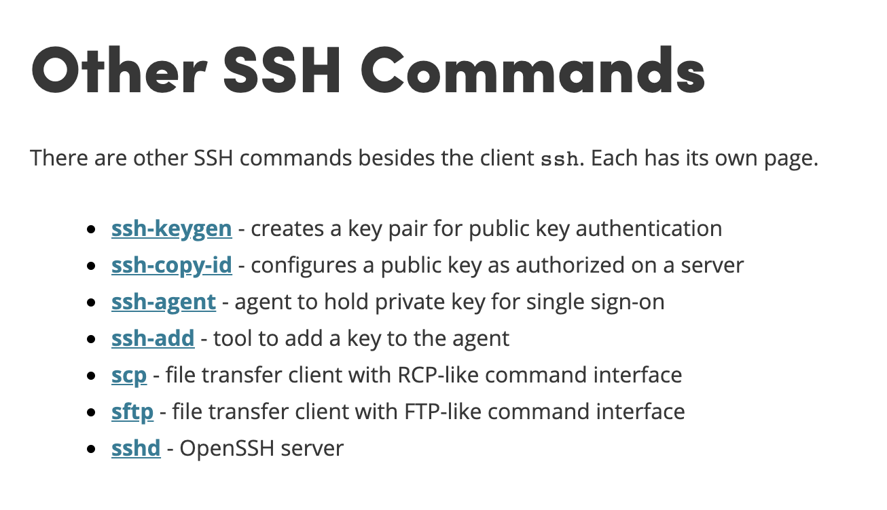

# SSH

SSH (Secure Shell) 在 [官网](https://www.ssh.com/ssh/command) 中特意标注了除 `ssh` 以外的其它命令，如下图所示。一个经常使用 Linux 的开发者必须熟练掌握 SSH，因此学习以下这些 SSH 套件中的常用命令是非常有必要的。这篇日志记录个人在系统性地学习 SSH 相关命令过程中的一些零碎笔记。



## [ssh](https://www.ssh.com/ssh)

`man ssh` 摘要：

```
NAME
    ssh -- OpenSSH SSH client (remote login program)

DESCRIPTION
    ssh (SSH client) is a program for logging into a remote machine and for executing commands on a remote machine.  It is intended to provide secure encrypted communications between two untrusted hosts over an insecure network.
```

`ssh` 是 OpenSSH 中的客户端连接工具，可用于登录远程主机和在远程主机上执行命令。`ssh` 命令通过网络连接，在两台主机之间提供了安全和加密的交互方式。

`ssh` 登录远程主机的简单和常用方式为： `ssh [-p port] [user@]hostname`。

## [ssh configuration](https://www.ssh.com/ssh/config/)

`man ssh_config` 摘要：

```
NAME
    ssh_config -- OpenSSH SSH client configuration files

DESCRIPTION
    ssh(1) obtains configuration data from the following sources in the following order:

           1.   command-line options
           2.   user's configuration file (~/.ssh/config)
           3.   system-wide configuration file (/etc/ssh/ssh_config)

    For each parameter, the first obtained value will be used.  The configuration files contain sections separated by Host specifications, and that section is only applied for hosts that match one of the patterns given in the specification.
```

SSH 为客户端提供了一种从配置文件获取配置的方式，`ssh` 会按照以下顺序获取配置数据：

1. 命令行选项
2. 用户级别配置文件（`~/.ssh/config`）
3. 系统级别配置文件（`/etc/ssh/ssh_config`）

SSH 配置文件的语法为：

- 空格和 `#` 开头的行会被忽略
- 每行以关键字开头，后面跟着参数
- 配置选项可以使用空格或者等号分隔
- 可以使用双引号（`"`）将参数括起来，用于指定包含空格的参数

一个简单的 SSH 配置文件示例如下：

```
~$ cat ~/.ssh/config
# 阿里云
Host aliyun
    HostName 11.22.33.44
    User root
    Port 22
# 腾讯云
Host tencent
    HostName 55.66.77.88
    User app
    Port 22222
```

## [ssh-keygen](https://www.ssh.com/ssh/keygen)

`man ssh-keygen` 摘要：

```
NAME
    ssh-keygen -- authentication key generation, management and conversion

DESCRIPTION
    ssh-keygen generates, manages and converts authentication keys for ssh(1).  ssh-keygen can create keys for use by SSH protocol version 2.

    The type of key to be generated is specified with the -t option.  If invoked without any arguments, ssh-keygen will generate an RSA key.
```

`ssh-keygen` 命令可用于生成、管理和转换 ssh 的认证密钥。`-t dsa | ecdsa | ed25519 | rsa` 参数可用于指定生成密钥的类型（默认值为 `rsa`），`-C comment` 参数可用于为密钥添加备注。

直接运行 `ssh-keygen` 命令，按照提示逐步操作，即可生成 id_rsa（密钥）和 id_rsa.pub（公钥）。

## [ssh-copy-id](https://www.ssh.com/ssh/copy-id)

## [ssh-agent](https://www.ssh.com/ssh/agent)

`man ssh-agent` 摘要：

```
NAME
    ssh-agent -- authentication agent

DESCRIPTION
```

## [ssh-add](https://www.ssh.com/ssh/add)

## [scp](https://www.ssh.com/ssh/scp)

## sftp

略

## [sshd](https://www.ssh.com/ssh/sshd)

略
