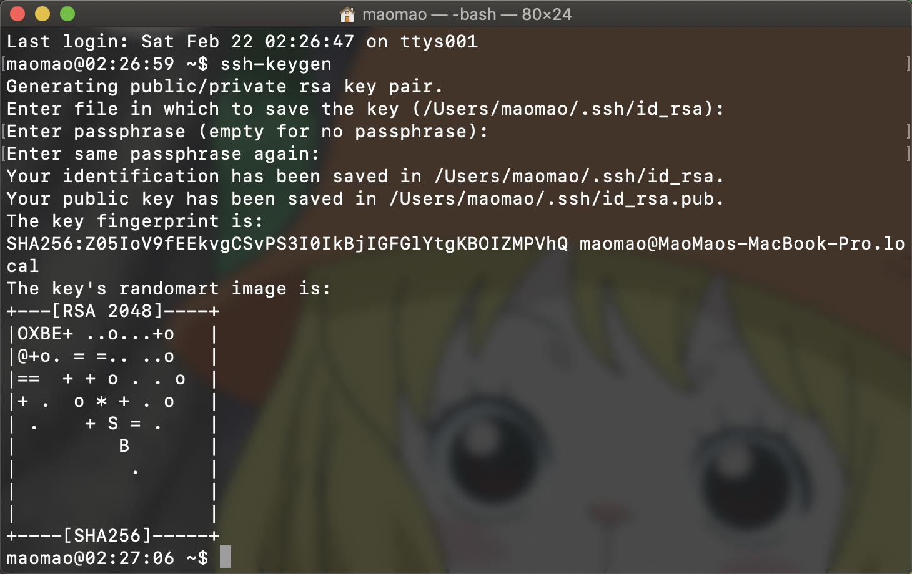

# SSH

这篇日志记录个人在系统性地学习 OpenSSH 相关工具过程中的一些零碎笔记，SSH 协议不在本篇日志的记录范围之内。

## [ssh](https://www.ssh.com/ssh)

大部分 Unix / Linux 系统都内置了 `ssh` 命令，用于在本机启动 SSH 客户端程序，建立与远程主机安全的连接。`ssh` 命令可以用于登录远程主机，在两台主机之间传输文件，以及在远程主机上执行命令。

使用 `ssh` 登录远程主机非常简单，常用形式如下：

```
ssh [-p port] [user@]host
```

使用 `ssh` 第一次连接到某台远程主机时，用户需要遵循提示，将这台远程主机的 host key 保存到本机的 `~/.ssh/known_hosts` 文件中。

使用 `ssh` 与远程主机建立连之后，用户需要输入密码进行身份认证。在身份认证成功之后，用户便会进入远程主机的 shell prompt（即等待用户输入 shell 命令的交互界面）。

---

`ssh` 也经常被用于这样的场景：无需登录至远程主机的 shell prompt 进行交互，可以直接执行远程主机上的命令，并返回执行结果至当前主机。在这种场景中，可以使用如下形式的 `ssh` 命令：

```
ssh [-p port] [user@]host [command]
```

---

`ssh` 默认会从用户级别的 `~/.ssh/config` 文件和系统级别的 `/etc/ssh/ssh_config` 文件读取 ssh 配置数据。`ssh` 命令行中的配置选项优先级最高，其次是用户级别的配置文件，再其次是系统级别的配置文件。`ssh` 配置文件的语法如下：

- 空格和以 `#` 开头的行会被忽略
- 每行以关键字开头，其后是所需的参数列表
- 配置选项之间可以使用空格或者等号分隔
- 可以使用双引号（`"`）将参数括起来，用于指定包含空格的参数

一个简单的 `ssh` 配置文件如下：

```
~$ cat ~/.ssh/config
# 阿里云
Host aliyun
    HostName 11.22.33.44
    User root
    Port 22
# 腾讯云
Host tencent
    HostName 55.66.77.88
    User app
    Port 22222
```

## [ssh-keygen](https://www.ssh.com/ssh/keygen)

SSH 协议使用公共密钥加密（public key cryptography）技术对主机和用户进行身份认证，其中的认证密钥被叫做 SSH 密钥，需要使用 `ssh-keygen` 命令创建。SSH 密钥可以用于自动登录、单次登录（只需登录一次）和主机认证。

创建 SSH 密钥最简单的方式是不带任何参数地直接运行 `ssh-keygen` 命令，在这种情况下，`ssh-keygen` 命令会提示用户 SSH 密钥文件的存储位置，如下图所示：



`ssh-keygen` 首先会主动询问用户密钥文件的存储位置，默认地址是 `~/.ssh/` 目录。其次会要求用户输入用于加密生成 SSH 密钥的密码短语，这个密码应该具备足够的加密强度。SSH.COM 站点上提供了一个用于生成足够强度的密码短语的在线服务，地址是：[https://www.ssh.com/iam/password/generator](https://www.ssh.com/iam/password/generator)。

SSH 支持多种用于认证密钥的公共密钥算法，包括 `rsa`、`dsa`、`ecdsa`、`ed25519`。在 `ssh-keygen` 中，提供了 `-t` 选项用于择选择这些算法（默认值为 `rsa`），还有 `-b` 选项用于指定密钥的字节长度。

## [ssh-copy-id](https://www.ssh.com/ssh/copy-id)

在 SSH 中为了使用公共密钥认证（public key authentication），公钥必须被拷贝至服务端，并需要被添加到 `./ssh/authorized_keys` 文件中。可以使用 `ssh-copy-id` 命令很方便地完成此操作，如下所示：

```
ssh-copy-id -i ~/.ssh/id_rsa user@host
```

在服务端配置了公钥之后，服务端将会允许携带密钥的所有正在连接中的用户登录。在登录过程中，客户端通过对 [密钥交换（Key Exchange）](https://en.wikipedia.org/wiki/Key_exchange) 进行 [数字签名（Digitally Signing）](https://en.wikipedia.org/wiki/Digital_signature) 来证明客户端是拥有密钥的。

## [ssh-agent](https://www.ssh.com/ssh/agent)

## [ssh-add](https://www.ssh.com/ssh/add)

## [scp](https://www.ssh.com/ssh/scp)

## sftp

略

## [sshd](https://www.ssh.com/ssh/sshd)

略
