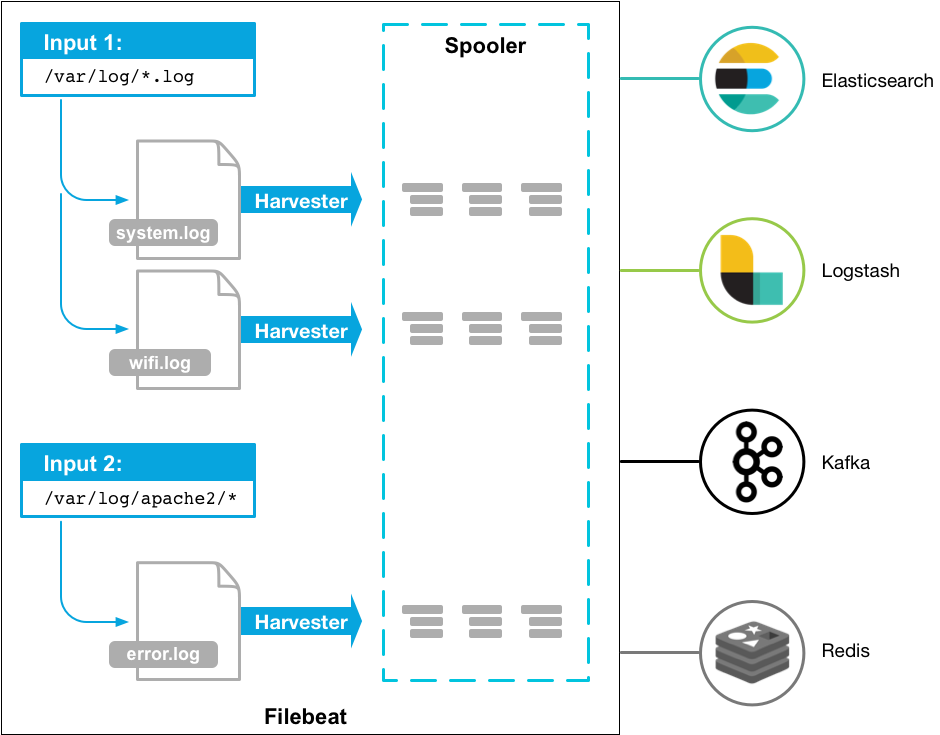

# Filebeat 和 Packetbeat

在实际工作中使用 Filebeat 有一段时间了，使用期间翻阅了大部分官方文档，学习和理解了挺多 Filebeat 的概念和知识点。近期又尝新使用了 Packetbeat，发现其配置和 Filebeat 大同小异，于是打算写一篇日志，记录两者基本的使用方式和配置参数。

## Beats 简介

[Filebeat](https://www.elastic.co/guide/en/beats/filebeat/7.3/index.html) 和 [Packetbeat](https://www.elastic.co/guide/en/beats/packetbeat/7.3/packetbeat-overview.html) 同属于 Elastic Stack 中的 [Beats](https://www.elastic.co/guide/en/beats/libbeat/7.3/beats-reference.html) 家族，是作为 agent 被安装在服务器上的开源的数据传输器（data shippers），用于把操作数据发送给 Elasticsearch。Elastic 公司提供了多种 Beat 系列产品用于捕获各种数据，完整列表如下：

<table>
<tr>
<td>Audit data</td>
<td><a href="https://www.elastic.co/products/beats/auditbeat">Auditbeat</a></td>
</tr>
<tr>
<td>Log files</td>
<td><a href="https://www.elastic.co/products/beats/filebeat">Filebeat</a></td>
</tr>
<tr>
<td>Cloud data</td>
<td><a href="https://www.elastic.co/products/beats/functionbeat">Functionbeat</a></td>
</tr>
<tr>
<td>Availability</td>
<td><a href="https://www.elastic.co/products/beats/heartbeat">Heartbeat</a></td>
</tr>
<tr>
<td>Systemd journals</td>
<td><a href="https://www.elastic.co/downloads/beats/journalbeat">Journalbeat</a></td>
</tr>
<tr>
<td>Metrics</td>
<td><a href="https://www.elastic.co/products/beats/metricbeat">Metricbeat</a></td>
</tr>
<tr>
<td>Network traffic</td>
<td><a href="https://www.elastic.co/products/beats/packetbeat">Packetbeat</a></td>
</tr>
<tr>
<td>Windows event logs</td>
<td><a href="https://www.elastic.co/products/beats/winlogbeat">Winlogbeat</a></td>
</tr>
</table>

Beats 可以直接把数据发送给 Elasticsearch 或者通过 Logstash 转发给 Elasticsearch，通过后者的方式可以使数据在 Kibana 可视化之前，被进一步地增强处理。


## Filebeat

Filebeat 是一个用于日志转发和收集的轻量级的数据传输器，Filebeat 会监听用户指定的文件或者目录，收集日志事件，随后将他们转发至 Elasticsearch 或者 Logstash 中。

### 组件和概念

Filebeat 内部包含了两个主要组件：Input 和 Harvester，用于监听日志文件的尾部追加内容（类似于 `tail -f file` 命令）。

**Harvester**

Harvester 负责读取单个文件的尾部追加内容。Filebeat 会为每个被监听的日志文件开启一个 Harvester。Harvester 负责在 Filebeat 内部打开和关闭日志文件，这意味着当 Harvester 正在运行的时候，日志文件的文件描述符总是保持打开的。

如果一个正在被 Harvester 监听的日志文件被移动或者删除了，Filebeat 会持续监听该文件，这是因为 Harvester 是通过依赖文件句柄而不是文件名来实现监听文件内容的。默认配置下，Filebeat 会一直监听日志文件，直到触发了 [`close_inactive`](https://www.elastic.co/guide/en/beats/filebeat/7.3/filebeat-input-log.html#filebeat-input-log-close-inactive) 配置。

关闭一个 Harvester 将会产生以下影响：

- 关闭文件句柄。如果日志文件在 Harvester 监听期间被删除了，那么 Filebeat 会释放监听处理程序的底层资源。
- 经过 [`scan_frequency`](https://www.elastic.co/guide/en/beats/filebeat/7.3/filebeat-input-log.html#filebeat-input-log-scan-frequency) 选项配置的时间间隔之后，Harvester 会再次被开启。
- 如果日志文件在 Harvester 关闭期间被移动或者删除了，那么该文件的 Harvester 则不会再开启。

Harvester 的具体关闭行为可以通过 [`close_*`](https://www.elastic.co/guide/en/beats/filebeat/7.3/filebeat-input-log.html#filebeat-input-log-close-options) 选项来配置。

---

**Input**

Input 负责管理 Harvester 和查找所有可读取的日志文件。对于类型是 `log` 的 Input，Filebeat 将会在磁盘上查找匹配预定义路径的所有日志文件，并为每个日志文件开启一个 Harvester。在 Filebeat 中，每一个 Input 都运行在它自己的 _goroutine_ 中。

以下示例配置会使 Filebeat 从匹配 `/var/log/*.log` 和 `/var/path2/*.log` 路径的日志文件中读取内容：

```yml
filebeat.inputs:
  - type: log
    paths:
      - /var/log/*.log
      - /var/path2/*.log
```

Filebeat 内置支持多种类型的 Input，完整列表请见 [官方文档](https://www.elastic.co/guide/en/beats/filebeat/7.3/configuration-filebeat-options.html#filebeat-input-types)。对于 `log` 类型的 Input，它将会检查每个日志文件，以查看是否需要启动 Harvester，是否已启动 Harvester，或者是否需要忽略这个日志文件。

### 工作流程

Filebeat 的大致工作流程如下：Filebeat 启动时会运行一个或多个 Input，用于在指定目录中查找日志文件。对于每个被查找到的日志文件，Filebeat 都会开启一个 Harvester。每个 Harvester 会读取它对应的日志文件尾部追加的新内容，并且发送日志数据给 libbeat。libbeat 会聚合日志事件，然后转发至 Elasticsearch 或者 Logstash。



### 内置模块

Filebeat 内置了很多开箱即用的常见应用日志收集模块，例如 `Kafka`、`MySQL`、`Nginx`、`Redis` 等等，完整列表请见 [官方文档](https://www.elastic.co/guide/en/beats/filebeat/7.3/filebeat-modules.html)。Filebeat 为这些模块提供了合理的默认配置，并且还定义了各个模块在 Elasticsearch 中对应的数据处理 [Pipeline](https://www.elastic.co/guide/en/elasticsearch/reference/7.3/pipeline.html)，以及在 Kibana 中对应的可视化 [Dashboard](https://www.elastic.co/guide/en/kibana/7.3/dashboard.html)。

Filebeat 提供了三种方式可以启用模块的方法，具体方式请见 [官方文档](https://www.elastic.co/guide/en/beats/filebeat/7.3/configuration-filebeat-modules.html)：

1. 在 `modules.d/` 目录中启用模块
2. 在 `./filebeat` 命令运行时启用模块
3. 在 `filebeat.yml` 配置文件中启用模块

## Packetbeat
